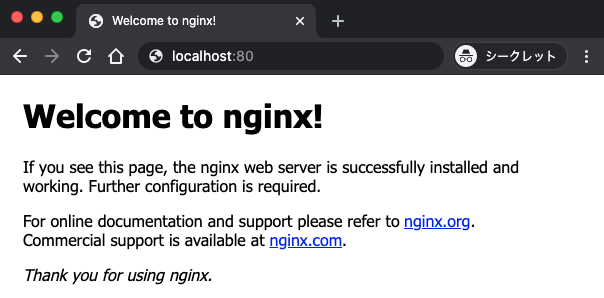

# Chapter01 Dockerことはじめ

### はじめに

ここではインストールされたDockerが正しく動作するか、Hello Worldの文字を表示させることで確認します。

### DockerでHello Worldを実行する

下記のコマンドで`hello-world`イメージを`docker run`で実行します。`docker run`は、コンテナを作成し、実行するコマンドです。何やら色々と表示されれば、問題なく動作していることが確認できます。

```text
➜ docker run hello-world
Unable to find image 'hello-world:latest' locally
latest: Pulling from library/hello-world
0e03bdcc26d7: Pull complete 
Digest: sha256:d58e752213a51785838f9eed2b7a498ffa1cb3aa7f946dda11af39286c3db9a9
Status: Downloaded newer image for hello-world:latest

Hello from Docker!
This message shows that your installation appears to be working correctly.

To generate this message, Docker took the following steps:
 1. The Docker client contacted the Docker daemon.
 2. The Docker daemon pulled the "hello-world" image from the Docker Hub.
    (amd64)
 3. The Docker daemon created a new container from that image which runs the
    executable that produces the output you are currently reading.
 4. The Docker daemon streamed that output to the Docker client, which sent it
    to your terminal.

To try something more ambitious, you can run an Ubuntu container with:
 $ docker run -it ubuntu bash

Share images, automate workflows, and more with a free Docker ID:
 https://hub.docker.com/

For more examples and ideas, visit:
 https://docs.docker.com/get-started/
```

和訳するとこのような感じのメッセージになります。

```text
➜ docker run hello-world
ローカルに'hello-world:latest'イメージが見つかりません。
library/hello-worldから最新のイメージをプルします。
0e03bdcc26d7: Pull complete
Digest: sha256:d58e752213a51785838f9eed2b7a498ffa1cb3aa7f946dda11af39286c3db9a9
Status: hello-world:latest用の新しいイメージをダウンロードしました。

Dockerからこんにちは!
このメッセージは、インストールが正常に動作しているように見えることを示しています。

このメッセージを生成するために、Dockerは以下の手順をとりました。
 1. DockerクライアントがDockerデーモンに連絡しました。
 2. DockerデーモンがDocker Hubから「hello-world」イメージを引っ張ってきました。
 3. Dockerデーモンは、そのイメージから新しいコンテナを作成し、そのコンテナは現在読み込んでいる出力を生成する実行可能ファイルを指定してください。
 4. Dockerデーモンはその出力をDockerクライアントにストリーム配信し、Dockerクライアントはその出力を自分のターミナルに移動します。

もっと野心的なことを試すには、Ubuntuのコンテナを実行してみましょう。
 $ docker run -it ubuntu bash

無料のDocker IDでイメージを共有したり、ワークフローを自動化できます。
 https://hub.docker.com/

より多くの例やアイデアについては、こちらをご覧ください。
 https://docs.docker.com/get-started/
```

この一覧の作業でDockerが行ったことを確認していきます。まず、Dockerクライアント\(ローカルPCからのコマンド\)がDockerデーモンに`hello-world`のイメージを探すように指示します。Dockerデーモンはローカル環境に`hello-world`のイメージがないので、Docker HubというDocker社がイメージを公開しているところに探しに行き、[`hello-world:latest`](https://hub.docker.com/_/hello-world)のイメージを取得します。Dockerデーモンはその`hello-world:latest`のイメージをもとにコンテナを構築し、デフォルトコマンドであるこの文字の出力を行っています。イメージがローカルにある場合は、Docker Hubに探しにいくのではなく、ローカルのイメージを利用します。

`docker run`は、イメージを取得する`docker pull`、イメージからコンテナを作成する`docker create`、 コンテナを起動する`docker start`の3つのコマンドを1つにまとめたものです。そのため、`docker run`を使わなくても、この3つのコマンドを実行すれば同じことができます。

### Ubuntuコンテナを構築する

野心的なことを試すにはUbuntuのコンテナを実行してみようと、ありますのでやってみましょう。`docker run`でubuntuのイメージを指定し、実行します。先程と同じように、ローカルにはイメージがないので、Docker Hubに探しにいき、[Ubuntuのイメージ](https://hub.docker.com/_/ubuntu)を取得し、デフォルトコマンドに指定されている`bash`を実行しています。`-it`は、オプションでstdinという入力チャネルを開け\(`-i`\)、レイアウトがキレイに表示\(`-t`\)されるようにするものです。

```text
➜ docker run -it ubuntu bash
Unable to find image 'ubuntu:latest' locally
latest: Pulling from library/ubuntu
a4a2a29f9ba4: Pull complete 
127c9761dcba: Pull complete 
d13bf203e905: Pull complete 
4039240d2e0b: Pull complete 
Digest: sha256:35c4a2c15539c6c1e4e5fa4e554dac323ad0107d8eb5c582d6ff386b383b7dce
Status: Downloaded newer image for ubuntu:latest

root@4be7603f43db:/#
```

使えるのかどうを確認するため、バージョンの確認をしてみます。

```text
root@4be7603f43db:/# cat /etc/os-release
NAME="Ubuntu"
VERSION="20.04 LTS (Focal Fossa)"
ID=ubuntu
ID_LIKE=debian
PRETTY_NAME="Ubuntu 20.04 LTS"
VERSION_ID="20.04"
HOME_URL="https://www.ubuntu.com/"
SUPPORT_URL="https://help.ubuntu.com/"
BUG_REPORT_URL="https://bugs.launchpad.net/ubuntu/"
PRIVACY_POLICY_URL="https://www.ubuntu.com/legal/terms-and-policies/privacy-policy"
VERSION_CODENAME=focal
UBUNTU_CODENAME=focal
```

`docker ps`で起動しているコンテナの状態を確認します。`STATUS`が`Up`になっているので起動中であることも確認できます。

```text
➜ docker ps
CONTAINER ID        IMAGE               COMMAND             CREATED             STATUS              PORTS               NAMES
4be7603f43db        ubuntu              "bash"              7 minutes ago       Up 7 minutes                            interesting_sinoussi
```

コンテナから抜け出すときは`exit`で抜けることができます。

```text
root@4be7603f43db:/# exit  
exit
```

Dockerが正しくインストールされているかどうかの確認を通じて、Dokerを動かしてみました。Dockerではイメージからコンテナを構築することで、環境の統一を図り、イメージが更新されたら、そのイメージを使ってコンテナを構築することで、複数の環境でも同一に動作できるような仕組みを作ることが可能になります。

不要なコンテナとイメージを削除してみます。停止しているコンテナの確認は`docker ps -a`で行い、コンテナの削除は`docker rm <CONTAINER ID> ...`で実行します。

```text
➜ docker ps -a
CONTAINER ID        IMAGE               COMMAND             CREATED             STATUS                        PORTS               NAMES
4be7603f43db        ubuntu              "bash"              9 minutes ago       Exited (130) 44 seconds ago                       interesting_sinoussi
434c493d1eb1        hello-world         "/hello"            31 minutes ago      Exited (0) 31 minutes ago                         ecstatic_vaughan
 
➜ docker rm 4be7603f43db 434c493d1eb1
4be7603f43db
434c493d1eb1
 
➜ docker ps -a
CONTAINER ID        IMAGE               COMMAND             CREATED             STATUS              PORTS               NAMES
```

不要なイメージの削除は`docker rmi`です。`rm`ではなく、`rmi`の点に注意。`docker images`で取得しているイメージの一覧が確認できます。

```text
➜ docker images
REPOSITORY          TAG                 IMAGE ID            CREATED             SIZE
ubuntu              latest              74435f89ab78        13 days ago         73.9MB
hello-world         latest              bf756fb1ae65        5 months ago        13.3kB
```

イメージの削除は`docker rmi <IMAGE ID> ...`で実行します。

```text
➜ docker rmi 74435f89ab78 bf756fb1ae65
Untagged: ubuntu:latest
Untagged: ubuntu@sha256:35c4a2c15539c6c1e4e5fa4e554dac323ad0107d8eb5c582d6ff386b383b7dce
Deleted: sha256:74435f89ab7825e19cf8c92c7b5c5ebd73ae2d0a2be16f49b3fb81c9062ab303
Deleted: sha256:8a8d1f0b34041a66f09e49bdc03e75c2190f606b0db7e08b75eb6747f7b49e11
Deleted: sha256:f1b8f74eff975ae600be0345aaac8f0a3d16680c2531ffc72f77c5e17cbfeeee
Deleted: sha256:27d46ebb54384edbc8c807984f9eb065321912422b0e6c49d6a9cd8c8b7d8ffc
Deleted: sha256:e1c75a5e0bfa094c407e411eb6cc8a159ee8b060cbd0398f1693978b4af9af10
Untagged: hello-world:latest
Untagged: hello-world@sha256:d58e752213a51785838f9eed2b7a498ffa1cb3aa7f946dda11af39286c3db9a9
Deleted: sha256:bf756fb1ae65adf866bd8c456593cd24beb6a0a061dedf42b26a993176745f6b
Deleted: sha256:9c27e219663c25e0f28493790cc0b88bc973ba3b1686355f221c38a36978ac63
 
➜ docker images
REPOSITORY          TAG                 IMAGE ID            CREATED             SIZE
```

### Webサーバーとしてコンテナを構築する

次はWebサーバーとして有名な[Nginxのイメージ](https://hub.docker.com/_/nginx)を使って、WebサーバーとしてDockerコンテナを起動してみます。`--name`でコンテナに名前を付けることができます。`-p`はポート80番でブラウザからHTTPでのアクセスを行うために記載します。`<ホスト側のポート>:<コンテナ側のポート>`として記述します。コロン前のホスト側のポートが外部に公開するポート番号で、コロン後ろはコンテナにマッピングするポート番号です。`80:80`というのは、コンテナを起動している80番ポートにアクセスすれば、コンテナ内部の80番ポートで待っているNginxに通信できます。

これを実行すると、コンテナを起動している手元のPCがWEBサーバーとして機能するようになります。`-d`をつけるとデタッチドモードでコンテナを起動できますが、ここでは特に必要ないので、オプションはつけません。デタッチドモード出ない場合、

```text
➜ docker run --name webserver -p 80:80 nginx
Unable to find image 'nginx:latest' locally
latest: Pulling from library/nginx
8559a31e96f4: Pull complete 
8d69e59170f7: Pull complete 
3f9f1ec1d262: Pull complete 
d1f5ff4f210d: Pull complete 
1e22bfa8652e: Pull complete 
Digest: sha256:21f32f6c08406306d822a0e6e8b7dc81f53f336570e852e25fbe1e3e3d0d0133
Status: Downloaded newer image for nginx:latest
/docker-entrypoint.sh: /docker-entrypoint.d/ is not empty, will attempt to perform configuration
/docker-entrypoint.sh: Looking for shell scripts in /docker-entrypoint.d/
/docker-entrypoint.sh: Launching /docker-entrypoint.d/10-listen-on-ipv6-by-default.sh
10-listen-on-ipv6-by-default.sh: Getting the checksum of /etc/nginx/conf.d/default.conf
10-listen-on-ipv6-by-default.sh: Enabled listen on IPv6 in /etc/nginx/conf.d/default.conf
/docker-entrypoint.sh: Launching /docker-entrypoint.d/20-envsubst-on-templates.sh
/docker-entrypoint.sh: Configuration complete; ready for start up
```

`http://www.localhost:80`でブラウザからアクセスすると、Nginxが起動していることがわかります。



別のターミナルを立ち上げて、コンテナの状態を確認します。`PORTS`の部分では、80番ポートを転送し、`NAMES`では`webserver`という名前のサーバーが機能していることがわかります。

```text
➜ docker ps
CONTAINER ID        IMAGE               COMMAND                  CREATED             STATUS              PORTS                NAMES
aebad5fdc293        nginx               "/docker-entrypoint.…"   4 minutes ago       Up 4 minutes        0.0.0.0:80->80/tcp   webserver
```

WebサーバーもDockerイメージを利用すれば簡単に構築することができます。コンテナを停止して、不要なコンテナとイメージを削除しておきます。コンテナを停止するには、`docker stop <CONTAINER ID>`で実行できます。`STATUS`をみると`Exited`になっていることが確認できます。

```text
➜ docker stop aebad5fdc293
aebad5fdc293

➜ docker ps -a
CONTAINER ID        IMAGE               COMMAND                  CREATED             STATUS                     PORTS               NAMES
aebad5fdc293        nginx               "/docker-entrypoint.…"   8 minutes ago       Exited (0) 6 seconds ago                       webserver
```

コンテナを停止したら、コンテナとイメージを削除しておきます。

```text
➜ docker rm aebad5fdc293
aebad5fdc293

➜ docker images
REPOSITORY          TAG                 IMAGE ID            CREATED             SIZE
nginx               latest              2622e6cca7eb        2 weeks ago         132MB

➜ docker rmi nginx
Untagged: nginx:latest
Untagged: nginx@sha256:21f32f6c08406306d822a0e6e8b7dc81f53f336570e852e25fbe1e3e3d0d0133
Deleted: sha256:2622e6cca7ebbb6e310743abce3fc47335393e79171b9d76ba9d4f446ce7b163
Deleted: sha256:e86d1b8b130bec203609b4b1d7b851bd763fa16e513e5a3fa6102ebea23260e0
Deleted: sha256:8f9f007533543813bb1aef80b791a16e5e16c7cbbbc456a3a483d0fa7a9effcc
Deleted: sha256:e2c0065a77fee75795cdcf9f19a72f11769332423cd52ec9e19aacfb878aec8b
Deleted: sha256:059442698ef65fe8545e4fe9657988a10329b9c3663b368ae7ee0007a9c43949
Deleted: sha256:13cb14c2acd34e45446a50af25cb05095a17624678dbafbcc9e26086547c1d74
```

以上がDockerの基本的な使い方のイメージでした。次のチャプターでは、Dockerコマンドに焦点をあててまとめていきます。


