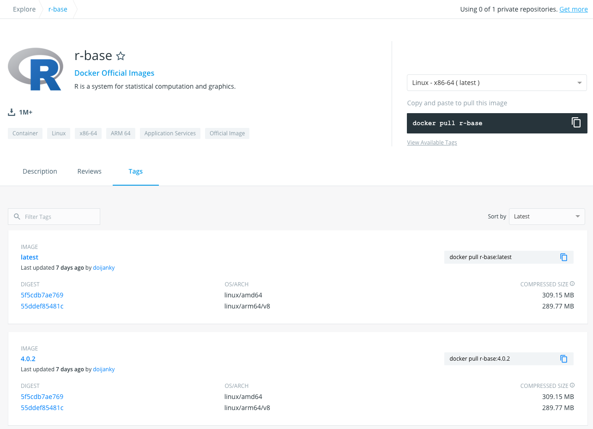

# Chapter02 Docker Command

### はじめに

ここではDockerの基本的なコマンドの使い方に焦点をあてて、まとめていきます。Dockerでは、イメージの取得などをはじめ、コンテナの起動から停止、削除までDockerコマンドで行います。

### Docker Hub

いきなりDockerコマンドではないですが、Docker Hubについて簡単に触れておきます。これは、Docker社が運営しているDockerイメージのレポジトリーサービスです。Docker Hubがあるので、手元のローカルPC、クラウド環境、様々な環境にイメージを共有することが可能です。

例えばRのイメージであれば下記にアクセスすることで情報を確認できます。

* [https://hub.docker.com/\_/r-base?tab=description](https://hub.docker.com/_/r-base?tab=description)

Tagsのページを見ると何やら、異なるバージョンのRのイメージが確認できます。



Dockerでは、イメージを管理する際にタグを利用します。例えば、タグを指定せずにDocker Hubからイメージを取得すると、1番上にある`latest`が取得されます。そのため、バージョンを指定してイメージを取得したい場合は、下記のようにタグでバージョンを指定します。

```text
➜ docker run r-base:4.0.2
```

### pullコマンド

それではDockerコマンドを見ていきましょう。まずは`pull`コマンドです。このコマンドはDoker HubからDockerイメージを取得する際に利用するコマンドです。DockerイメージをDoker Hubではなく他の場所で管理している場合にも利用できます。下記は[tensorflow.org](https://www.tensorflow.org/install/docker?hl=ja)で公開されている機械学習用のフレームワークであるtensorflowのDockerイメージを取得する際のコマンドです。

```text
→ docker pull tensorflow/tensorflow:latest-gpu-jupyter
```

オプションは下記の通り用意されています。`-a`をつけると全てのイメージを取得できるようです。

```text
➜ docker pull --help

Usage:	docker pull [OPTIONS] NAME[:TAG|@DIGEST]

Pull an image or a repository from a registry

Options:
  -a, --all-tags                Download all tagged images in the repository
      --disable-content-trust   Skip image verification (default true)
  -q, --quiet                   Suppress verbose output
```

### imagesコマンド

`images`コマンドは、取得したイメージを表示するためのコマンドです。現在はイメージがなにもないので、`whalesay`イメージを取得して`images`コマンドを実行してみます。`whalesay`イメージはDockerのロゴでもあるクジラに文字列を喋らせるイメージです

```text
➜ docker run docker/whalesay cowsay Docker for Data Anaylsis
Unable to find image 'docker/whalesay:latest' locally
latest: Pulling from docker/whalesay
Image docker.io/docker/whalesay:latest uses outdated schema1 manifest format. Please upgrade to a schema2 image for better future compatibility. More information at https://docs.docker.com/registry/spec/deprecated-schema-v1/
e190868d63f8: Pull complete 
909cd34c6fd7: Pull complete 
0b9bfabab7c1: Pull complete 
a3ed95caeb02: Pull complete 
00bf65475aba: Pull complete 
c57b6bcc83e3: Pull complete 
8978f6879e2f: Pull complete 
8eed3712d2cf: Pull complete 
Digest: sha256:178598e51a26abbc958b8a2e48825c90bc22e641de3d31e18aaf55f3258ba93b
Status: Downloaded newer image for docker/whalesay:latest
 __________________________________ 
< Docker for Data Anaylsis >
 ---------------------------------- 
    \
     \
      \     
                    ##        .            
              ## ## ##       ==            
           ## ## ## ##      ===            
       /""""""""""""""""___/ ===        
  ~~~ {~~ ~~~~ ~~~ ~~~~ ~~ ~ /  ===- ~~~   
       \______ o          __/            
        \    \        __/             
          \____\______/   
```

`images`コマンドを実行してみます。取得先を示す`REPOSITORY`、バージョンを示す`TAG`、イメージの識別子である`IMAGE ID`、イメージ作成日である`CREATED`、Dockerイメージのサイズを表す`SIZE`が表示されます。

```text
➜ docker images
REPOSITORY          TAG                 IMAGE ID            CREATED             SIZE
docker/whalesay     latest              6b362a9f73eb        5 years ago         247MB
```

オプションは下記の通り用意されています。`-q`をつけると`IMAGE ID`のみを表示できます。

```text
➜ docker images --help

Usage:	docker images [OPTIONS] [REPOSITORY[:TAG]]

List images

Options:
  -a, --all             Show all images (default hides intermediate images)
      --digests         Show digests
  -f, --filter filter   Filter output based on conditions provided
      --format string   Pretty-print images using a Go template
      --no-trunc        Don't truncate output
  -q, --quiet           Only show numeric IDs
```

### inspectコマンド

`inspect`コマンドはイメージの詳細を確認するためのコマンドです。`docker/whalesay`のイメージIDである`6b362a9f73eb`を使ってみます。結果は下記のようなJSON形式で表示されます。

```text
➜ docker inspect 6b362a9f73eb
[
    {
        "Id": "sha256:6b362a9f73eb8c33b48c95f4fcce1b6637fc25646728cf7fb0679b2da273c3f4",
        "RepoTags": [
            "docker/whalesay:latest"
        ],
        "RepoDigests": [
            "docker/whalesay@sha256:178598e51a26abbc958b8a2e48825c90bc22e641de3d31e18aaf55f3258ba93b"
        ],
        "Parent": "",
        "Comment": "",
        "Created": "2015-05-25T22:04:23.303454458Z",
        "Container": "5460b2353ce4e2b3e3e81b4a523a61c5adc238ae21d3ec3a5774674652e6317f",
        "ContainerConfig": {
            "Hostname": "9ec8c01a6a48",
            "Domainname": "",
            "User": "",
            "AttachStdin": false,
            "AttachStdout": false,
            "AttachStderr": false,
            "Tty": false,
            "OpenStdin": false,
            "StdinOnce": false,
            "Env": [
                "PATH=/usr/local/bin:/usr/local/sbin:/usr/local/bin:/usr/sbin:/usr/bin:/sbin:/bin"
            ],
            "Cmd": [
                "/bin/sh",
                "-c",
                "#(nop) ENV PATH=/usr/local/bin:/usr/local/sbin:/usr/local/bin:/usr/sbin:/usr/bin:/sbin:/bin"
            ],
            "Image": "5d5bd9951e26ca0301423625b19764bda914ae39c3f2bfd6f1824bf5354d10ee",
            "Volumes": null,
            "WorkingDir": "/cowsay",
            "Entrypoint": null,
            "OnBuild": [],
            "Labels": {}
        },
        "DockerVersion": "1.6.0",
        "Author": "",
        "Config": {
            "Hostname": "9ec8c01a6a48",
            "Domainname": "",
            "User": "",
            "AttachStdin": false,
            "AttachStdout": false,
            "AttachStderr": false,
            "Tty": false,
            "OpenStdin": false,
            "StdinOnce": false,
            "Env": [
                "PATH=/usr/local/bin:/usr/local/sbin:/usr/local/bin:/usr/sbin:/usr/bin:/sbin:/bin"
            ],
            "Cmd": [
                "/bin/bash"
            ],
            "Image": "5d5bd9951e26ca0301423625b19764bda914ae39c3f2bfd6f1824bf5354d10ee",
            "Volumes": null,
            "WorkingDir": "/cowsay",
            "Entrypoint": null,
            "OnBuild": [],
            "Labels": {}
        },
        "Architecture": "amd64",
        "Os": "linux",
        "Size": 247049019,
        "VirtualSize": 247049019,
        "GraphDriver": {
            "Data": {
                "LowerDir": "/var/lib/docker/overlay2/4793bfcf61cb4580f5ce461c3137b395b0f9bf22dc312506b26b3809dcfd0da7/diff:/var/lib/docker/overlay2/df4ed103181e2a010ce61a004fee6d34d645f501ed6e82c36ebc61277692a183/diff:/var/lib/docker/overlay2/5c1cdae481b5cc8a990c3a3aeda87aa7b0c9dbcce4f3e88cfdcdc3a40c9482f8/diff:/var/lib/docker/overlay2/714408e4381532961e6674999df1cdc2901c62c6fa2e0ff071dc5f6b30f6ae80/diff:/var/lib/docker/overlay2/a533ccf4f45667e3bc9ba955d54982383448918cf82efed2a39984939d5ade85/diff:/var/lib/docker/overlay2/2137f8a677bfebb685bb6d5f3113e154a796669cfbec88ff2a6842f51c4c27a9/diff:/var/lib/docker/overlay2/ab976430e21af5805122d8ca9f1b248bf2c777a4adca4d0e742c872e74549f21/diff:/var/lib/docker/overlay2/cd95c2c199fd397d25e49f211b3ef5ba0b83d14287ceffca95adf0624c4540f6/diff:/var/lib/docker/overlay2/624d6d86757cde2f4ccfddb74f8da7fbadf8d7b7b755aea589a19a5231d959a5/diff",
                "MergedDir": "/var/lib/docker/overlay2/71c6d7822590a6c594a6701364ff43926426befd8d98cf619ad839c691eba1ee/merged",
                "UpperDir": "/var/lib/docker/overlay2/71c6d7822590a6c594a6701364ff43926426befd8d98cf619ad839c691eba1ee/diff",
                "WorkDir": "/var/lib/docker/overlay2/71c6d7822590a6c594a6701364ff43926426befd8d98cf619ad839c691eba1ee/work"
            },
            "Name": "overlay2"
        },
        "RootFS": {
            "Type": "layers",
            "Layers": [
                "sha256:1154ba695078d29ea6c4e1adb55c463959cd77509adf09710e2315827d66271a",
                "sha256:528c8710fd95f61d40b8bb8a549fa8dfa737d9b9c7c7b2ae55f745c972dddacd",
                "sha256:37ee47034d9b78f10f0c5ce3a25e6b6e58997fcadaf5f896c603a10c5f35fb31",
                "sha256:5f70bf18a086007016e948b04aed3b82103a36bea41755b6cddfaf10ace3c6ef",
                "sha256:b26122d57afa5c4a2dc8db3f986410805bc8792af3a4fa73cfde5eed0a8e5b6d",
                "sha256:091abc5148e4d32cecb5522067509d7ffc1e8ac272ff75d2775138639a6c50ca",
                "sha256:5f70bf18a086007016e948b04aed3b82103a36bea41755b6cddfaf10ace3c6ef",
                "sha256:d511ed9e12e17ab4bfc3e80ed7ce86d4aac82769b42f42b753a338ed9b8a566d",
                "sha256:d061ee1340ecc8d03ca25e6ca7f7502275f558764c1ab46bd1f37854c74c5b3f",
                "sha256:5f70bf18a086007016e948b04aed3b82103a36bea41755b6cddfaf10ace3c6ef"
            ]
        },
        "Metadata": {
            "LastTagTime": "0001-01-01T00:00:00Z"
        }
    }
]

```

オプションは下記の通り用意されています。

```text
➜ docker inspect --help

Usage:	docker inspect [OPTIONS] NAME|ID [NAME|ID...]

Return low-level information on Docker objects

Options:
  -f, --format string   Format the output using the given Go template
  -s, --size            Display total file sizes if the type is container
      --type string     Return JSON for specified type
```

### tagコマンド

`tag`コマンドはイメージのバージョンを管理するタグを付与するコマンドです。イメージの元になるソースイメージを指定して、タグを指定します。IMAGE IDを見ると同一IDであることがわかります。つまり実態は同じであってコピーや名前を変更したわけではありません。

```text
# docker tag SOURCE_IMAGE[:TAG] TARGET_IMAGE[:TAG]
➜ docker tag docker/whalesay docker/whalesay:new
 
➜ docker images 
REPOSITORY          TAG                 IMAGE ID            CREATED             SIZE
docker/whalesay     latest              6b362a9f73eb        5 years ago         247MB
docker/whalesay     new                 6b362a9f73eb        5 years ago         247MB
```

