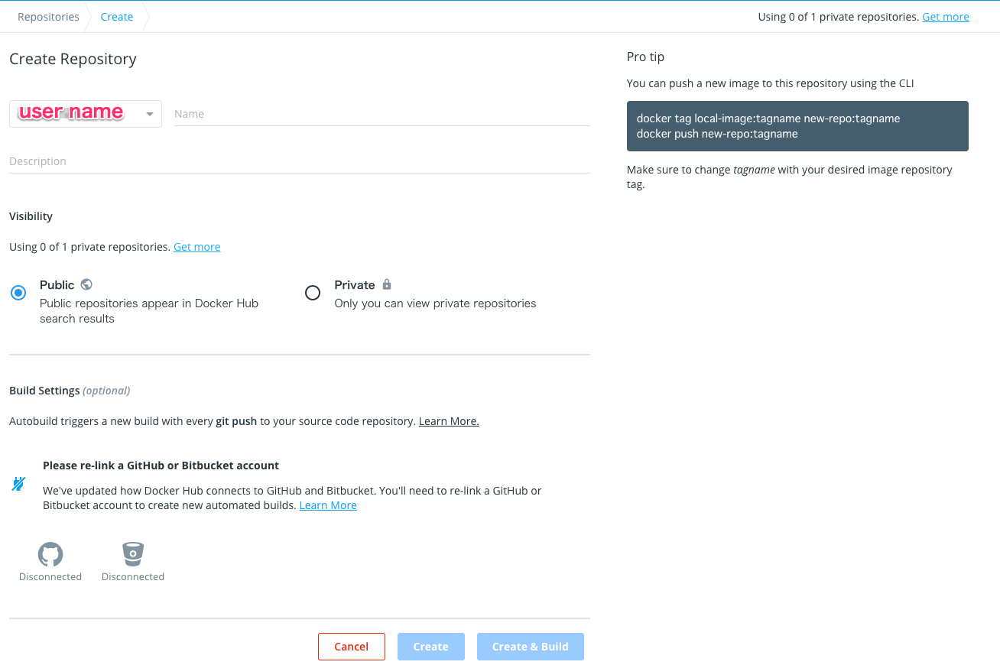

# Chapter02 Docker Command

### はじめに

ここではDockerの基本的なコマンドの使い方に焦点をあてて、まとめていきます。Dockerでは、イメージの取得などをはじめ、コンテナの起動から停止、削除まで「Dockerコマンド」で行います。

### Docker Hub

いきなりDockerコマンドではないですが、Docker Hubについて簡単に触れておきます。これは、Docker社が運営しているDockerイメージのレポジトリーサービスです。Docker Hubがあるので、手元のローカルPC、クラウド環境、様々な環境にイメージを共有することが可能です。

例えばRのイメージであれば下記にアクセスすることで情報を確認できます。

* [https://hub.docker.com/\_/r-base?tab=description](https://hub.docker.com/_/r-base?tab=description)

Tagsのページを見ると何やら、異なるバージョンのRのイメージが確認できます。


Dockerでは、イメージを管理する際にタグを利用します。例えば、タグを指定せずにDocker Hubからイメージを取得すると、1番上にある`latest`が取得されます。そのため、バージョンを指定してイメージを取得したい場合は、下記のようにタグでバージョンを指定します。

```text
➜ docker run r-base:4.0.2
```

ここからはDockerイメージに関するコマンドとDockerコンテナに関するコマンドに分けて、Dockerコマンドをまとめます。

### Dockerコマンド~Dockerイメージ~

Docker Hubのイメージもつかめたところで、まずはDockerイメージに関するDockerコマンドを見ていきます。

#### pullコマンド

まずは`pull`コマンドです。このコマンドはDoker HubからDockerイメージを取得する際に利用するコマンドです。DockerイメージをDoker Hubではなく他の場所で管理している場合にも利用できます。下記は[tensorflow.org](https://www.tensorflow.org/install/docker?hl=ja)で公開されている機械学習用のフレームワークであるtensorflowのDockerイメージを取得する際のコマンドです。

```text
→ docker pull tensorflow/tensorflow:latest-gpu-jupyter
```

オプションは下記の通り用意されています。`-a`をつけると全てのイメージを取得できます。

```text
➜ docker pull --help

Usage:	docker pull [OPTIONS] NAME[:TAG|@DIGEST]

Pull an image or a repository from a registry

Options:
  -a, --all-tags                Download all tagged images in the repository
      --disable-content-trust   Skip image verification (default true)
  -q, --quiet                   Suppress verbose output
```

#### imagesコマンド

`images`コマンドは、取得したイメージを表示するためのコマンドです。現在はイメージがなにもないので、`whalesay`イメージを取得して`images`コマンドを実行してみます。`whalesay`イメージはDockerのロゴでもあるクジラに文字列を喋らせるイメージです

```text
➜ docker run docker/whalesay cowsay Docker for Data Anaylsis
Unable to find image 'docker/whalesay:latest' locally
latest: Pulling from docker/whalesay
Image docker.io/docker/whalesay:latest uses outdated schema1 manifest format. Please upgrade to a schema2 image for better future compatibility. More information at https://docs.docker.com/registry/spec/deprecated-schema-v1/
e190868d63f8: Pull complete 
909cd34c6fd7: Pull complete 
0b9bfabab7c1: Pull complete 
a3ed95caeb02: Pull complete 
00bf65475aba: Pull complete 
c57b6bcc83e3: Pull complete 
8978f6879e2f: Pull complete 
8eed3712d2cf: Pull complete 
Digest: sha256:178598e51a26abbc958b8a2e48825c90bc22e641de3d31e18aaf55f3258ba93b
Status: Downloaded newer image for docker/whalesay:latest
 __________________________________ 
< Docker for Data Anaylsis >
 ---------------------------------- 
    \
     \
      \     
                    ##        .            
              ## ## ##       ==            
           ## ## ## ##      ===            
       /""""""""""""""""___/ ===        
  ~~~ {~~ ~~~~ ~~~ ~~~~ ~~ ~ /  ===- ~~~   
       \______ o          __/            
        \    \        __/             
          \____\______/   
```

`images`コマンドを実行してみます。取得先を示す`REPOSITORY`、バージョンを示す`TAG`、イメージの識別子である`IMAGE ID`、イメージ作成日である`CREATED`、Dockerイメージのサイズを表す`SIZE`が表示されます。

```text
➜ docker images
REPOSITORY          TAG                 IMAGE ID            CREATED             SIZE
docker/whalesay     latest              6b362a9f73eb        5 years ago         247MB
```

オプションは下記の通り用意されています。`-q`をつけると`IMAGE ID`のみを表示できます。

```text
➜ docker images --help

Usage:	docker images [OPTIONS] [REPOSITORY[:TAG]]

List images

Options:
  -a, --all             Show all images (default hides intermediate images)
      --digests         Show digests
  -f, --filter filter   Filter output based on conditions provided
      --format string   Pretty-print images using a Go template
      --no-trunc        Don't truncate output
  -q, --quiet           Only show numeric IDs
```

#### inspectコマンド

`inspect`コマンドはイメージの詳細を確認するためのコマンドです。`docker/whalesay`のイメージIDである`6b362a9f73eb`を使ってみます。結果は下記のようなJSON形式で表示されます。

```text
➜ docker inspect 6b362a9f73eb
[
    {
        "Id": "sha256:6b362a9f73eb8c33b48c95f4fcce1b6637fc25646728cf7fb0679b2da273c3f4",
        "RepoTags": [
            "docker/whalesay:latest"
        ],
        "RepoDigests": [
            "docker/whalesay@sha256:178598e51a26abbc958b8a2e48825c90bc22e641de3d31e18aaf55f3258ba93b"
        ],
        "Parent": "",
        "Comment": "",
        "Created": "2015-05-25T22:04:23.303454458Z",
        "Container": "5460b2353ce4e2b3e3e81b4a523a61c5adc238ae21d3ec3a5774674652e6317f",
        "ContainerConfig": {
            "Hostname": "9ec8c01a6a48",
            "Domainname": "",
            "User": "",
            "AttachStdin": false,
            "AttachStdout": false,
            "AttachStderr": false,
            "Tty": false,
            "OpenStdin": false,
            "StdinOnce": false,
            "Env": [
                "PATH=/usr/local/bin:/usr/local/sbin:/usr/local/bin:/usr/sbin:/usr/bin:/sbin:/bin"
            ],
            "Cmd": [
                "/bin/sh",
                "-c",
                "#(nop) ENV PATH=/usr/local/bin:/usr/local/sbin:/usr/local/bin:/usr/sbin:/usr/bin:/sbin:/bin"
            ],
            "Image": "5d5bd9951e26ca0301423625b19764bda914ae39c3f2bfd6f1824bf5354d10ee",
            "Volumes": null,
            "WorkingDir": "/cowsay",
            "Entrypoint": null,
            "OnBuild": [],
            "Labels": {}
        },
        "DockerVersion": "1.6.0",
        "Author": "",
        "Config": {
            "Hostname": "9ec8c01a6a48",
            "Domainname": "",
            "User": "",
            "AttachStdin": false,
            "AttachStdout": false,
            "AttachStderr": false,
            "Tty": false,
            "OpenStdin": false,
            "StdinOnce": false,
            "Env": [
                "PATH=/usr/local/bin:/usr/local/sbin:/usr/local/bin:/usr/sbin:/usr/bin:/sbin:/bin"
            ],
            "Cmd": [
                "/bin/bash"
            ],
            "Image": "5d5bd9951e26ca0301423625b19764bda914ae39c3f2bfd6f1824bf5354d10ee",
            "Volumes": null,
            "WorkingDir": "/cowsay",
            "Entrypoint": null,
            "OnBuild": [],
            "Labels": {}
        },
        "Architecture": "amd64",
        "Os": "linux",
        "Size": 247049019,
        "VirtualSize": 247049019,
        "GraphDriver": {
            "Data": {
                "LowerDir": "/var/lib/docker/overlay2/4793bfcf61cb4580f5ce461c3137b395b0f9bf22dc312506b26b3809dcfd0da7/diff:/var/lib/docker/overlay2/df4ed103181e2a010ce61a004fee6d34d645f501ed6e82c36ebc61277692a183/diff:/var/lib/docker/overlay2/5c1cdae481b5cc8a990c3a3aeda87aa7b0c9dbcce4f3e88cfdcdc3a40c9482f8/diff:/var/lib/docker/overlay2/714408e4381532961e6674999df1cdc2901c62c6fa2e0ff071dc5f6b30f6ae80/diff:/var/lib/docker/overlay2/a533ccf4f45667e3bc9ba955d54982383448918cf82efed2a39984939d5ade85/diff:/var/lib/docker/overlay2/2137f8a677bfebb685bb6d5f3113e154a796669cfbec88ff2a6842f51c4c27a9/diff:/var/lib/docker/overlay2/ab976430e21af5805122d8ca9f1b248bf2c777a4adca4d0e742c872e74549f21/diff:/var/lib/docker/overlay2/cd95c2c199fd397d25e49f211b3ef5ba0b83d14287ceffca95adf0624c4540f6/diff:/var/lib/docker/overlay2/624d6d86757cde2f4ccfddb74f8da7fbadf8d7b7b755aea589a19a5231d959a5/diff",
                "MergedDir": "/var/lib/docker/overlay2/71c6d7822590a6c594a6701364ff43926426befd8d98cf619ad839c691eba1ee/merged",
                "UpperDir": "/var/lib/docker/overlay2/71c6d7822590a6c594a6701364ff43926426befd8d98cf619ad839c691eba1ee/diff",
                "WorkDir": "/var/lib/docker/overlay2/71c6d7822590a6c594a6701364ff43926426befd8d98cf619ad839c691eba1ee/work"
            },
            "Name": "overlay2"
        },
        "RootFS": {
            "Type": "layers",
            "Layers": [
                "sha256:1154ba695078d29ea6c4e1adb55c463959cd77509adf09710e2315827d66271a",
                "sha256:528c8710fd95f61d40b8bb8a549fa8dfa737d9b9c7c7b2ae55f745c972dddacd",
                "sha256:37ee47034d9b78f10f0c5ce3a25e6b6e58997fcadaf5f896c603a10c5f35fb31",
                "sha256:5f70bf18a086007016e948b04aed3b82103a36bea41755b6cddfaf10ace3c6ef",
                "sha256:b26122d57afa5c4a2dc8db3f986410805bc8792af3a4fa73cfde5eed0a8e5b6d",
                "sha256:091abc5148e4d32cecb5522067509d7ffc1e8ac272ff75d2775138639a6c50ca",
                "sha256:5f70bf18a086007016e948b04aed3b82103a36bea41755b6cddfaf10ace3c6ef",
                "sha256:d511ed9e12e17ab4bfc3e80ed7ce86d4aac82769b42f42b753a338ed9b8a566d",
                "sha256:d061ee1340ecc8d03ca25e6ca7f7502275f558764c1ab46bd1f37854c74c5b3f",
                "sha256:5f70bf18a086007016e948b04aed3b82103a36bea41755b6cddfaf10ace3c6ef"
            ]
        },
        "Metadata": {
            "LastTagTime": "0001-01-01T00:00:00Z"
        }
    }
]

```

オプションは下記の通り用意されています。

```text
➜ docker inspect --help

Usage:	docker inspect [OPTIONS] NAME|ID [NAME|ID...]

Return low-level information on Docker objects

Options:
  -f, --format string   Format the output using the given Go template
  -s, --size            Display total file sizes if the type is container
      --type string     Return JSON for specified type
```

#### tagコマンド

`tag`コマンドはイメージのバージョンを管理するタグを付与するコマンドです。イメージの元になるソースイメージを指定して、タグを指定します。IMAGE IDを見ると同一IDであることがわかります。つまり実態は同じであってコピーや名前を変更したわけではありません。

```text
# docker tag SOURCE_IMAGE[:TAG] TARGET_IMAGE[:TAG]
➜ docker tag docker/whalesay docker/whalesay:new
 
➜ docker images 
REPOSITORY          TAG                 IMAGE ID            CREATED             SIZE
docker/whalesay     latest              6b362a9f73eb        5 years ago         247MB
docker/whalesay     new                 6b362a9f73eb        5 years ago         247MB
```

#### rmiコマンド

`rmi`コマンドはDockerイメージを削除するコマンドです。`docker/whalesay`のイメージを削除してみます。タグが付与していたり、コンテナが参照している場合は消せないので、そのような場合、タグが付与されたイメージや`-f`オプションを付けて削除します。

```text
➜ docker images
REPOSITORY          TAG                 IMAGE ID            CREATED             SIZE
docker/whalesay     latest              6b362a9f73eb        5 years ago         247MB
docker/whalesay     new                 6b362a9f73eb        5 years ago         247MB
 
➜ docker rmi 6b362a9f73eb
Error response from daemon: conflict: unable to delete 6b362a9f73eb (must be forced) - image is referenced in multiple repositories
 
➜ docker rmi docker/whalesay:new
Untagged: docker/whalesay:new
 
➜ docker images
REPOSITORY          TAG                 IMAGE ID            CREATED             SIZE
docker/whalesay     latest              6b362a9f73eb        5 years ago         247MB
 
➜ docker rmi 6b362a9f73eb
Error response from daemon: conflict: unable to delete 6b362a9f73eb (must be forced) - image is being used by stopped container de692b7c424a
 
➜ docker rmi -f 6b362a9f73eb
Untagged: docker/whalesay:latest
Untagged: docker/whalesay@sha256:178598e51a26abbc958b8a2e48825c90bc22e641de3d31e18aaf55f3258ba93b
Deleted: sha256:6b362a9f73eb8c33b48c95f4fcce1b6637fc25646728cf7fb0679b2da273c3f4
```

オプションは下記の通り用意されています。

```text
➜ docker rmi --help

Usage:	docker rmi [OPTIONS] IMAGE [IMAGE...]

Remove one or more images

Options:
  -f, --force      Force removal of the image
      --no-prune   Do not delete untagged parents
```

不要なコンテナを削除しておきます。

```text
➜ docker rm de692b7c424a
de692b7c424a
```

#### pushコマンド

`push`コマンドはDocker Hubにイメージを公開する際に利用するコマンドです。

```text
➜ docker push --help

Usage:	docker push [OPTIONS] NAME[:TAG]

Push an image or a repository to a registry

Options:
      --disable-content-trust   Skip image signing (default true)

```

下記のようにDocker Hubにリポジトリを作成してイメージをアップすることが可能です。



### Dockerコマンド~Dockerコンテナ~

次はコンテナに関するコマンドを見ていきます。

#### runコマンド

`run`コマンドはDockerコンテナの構築と起動を同時に行うコマンドです。試しにubuntuのイメージを使って`run`コマンドを実行します。デフォルトコマンド\(`bash`\)で指定したコマンドが実行されます。`-it`はコンテナの標準出力\(`-i`\)を開き、端末デバイスを確保するという意味のtty\(`-t`\)の略です。`run`コマンドはオプションが大量にあるので、いくつかをピックアップしてまとめておきます。

```text
➜ docker run -it ubuntu bash
Unable to find image 'ubuntu:latest' locally
latest: Pulling from library/ubuntu
a4a2a29f9ba4: Pull complete 
127c9761dcba: Pull complete 
d13bf203e905: Pull complete 
4039240d2e0b: Pull complete 
Digest: sha256:35c4a2c15539c6c1e4e5fa4e554dac323ad0107d8eb5c582d6ff386b383b7dce
Status: Downloaded newer image for ubuntu:latest
root@c662db5d633f:/# 
```

コンテナからexitで抜けると、コンテナの`STATUS`は`Exited`になります。コンテナを使い捨てたい場合は`--rm`オプションをつけます。

```text
➜ docker ps -a
CONTAINER ID        IMAGE               COMMAND             CREATED              STATUS                       PORTS               NAMES
c662db5d633f        ubuntu              "bash"              About a minute ago   Exited (130) 5 seconds ago                       blissful_blackburn

➜ docker rm c662db5d633f
c662db5d633f
```

オプションを付けてコンテナを`run`コマンドを実行します。

```text
➜ docker run -it --rm ubuntu bash

root@667339feb45d:/# exit
exit

➜ docker ps -a
CONTAINER ID        IMAGE               COMMAND             CREATED             STATUS              PORTS               NAMES
```

コンテナの起動にはバックグラウンドモード\(デタッチドモード\)とフォアグラウンドモードがあります。バックグラウンドモードの場合は`-d`オプションを付けます。コンテナの起動後、すぐにホストに戻ってきます。状況を確認すると`Up`のままなので、バックグラウンドで起動していることがわかります。

```text
➜ docker run -it -d ubuntu bash
b381e59f3a2bbcf5af282315f08420d9c1171883de0955301c45c9465887ea58
 
➜ docker ps 
CONTAINER ID        IMAGE               COMMAND             CREATED             STATUS              PORTS               NAMES
b381e59f3a2b        ubuntu              "bash"              4 seconds ago       Up 3 seconds                            quizzical_jepsen
```

次はポート\(`-p`\)を指定してコンテナを起動します。Nginxのイメージを使ってコンテナを実行します。

```text
➜ docker run -p 12345:80 nginx
Unable to find image 'nginx:latest' locally
latest: Pulling from library/nginx
8559a31e96f4: Pull complete 
8d69e59170f7: Pull complete 
3f9f1ec1d262: Pull complete 
d1f5ff4f210d: Pull complete 
1e22bfa8652e: Pull complete 
Digest: sha256:21f32f6c08406306d822a0e6e8b7dc81f53f336570e852e25fbe1e3e3d0d0133
Status: Downloaded newer image for nginx:latest
/docker-entrypoint.sh: /docker-entrypoint.d/ is not empty, will attempt to perform configuration
/docker-entrypoint.sh: Looking for shell scripts in /docker-entrypoint.d/
/docker-entrypoint.sh: Launching /docker-entrypoint.d/10-listen-on-ipv6-by-default.sh
10-listen-on-ipv6-by-default.sh: Getting the checksum of /etc/nginx/conf.d/default.conf
10-listen-on-ipv6-by-default.sh: Enabled listen on IPv6 in /etc/nginx/conf.d/default.conf
/docker-entrypoint.sh: Launching /docker-entrypoint.d/20-envsubst-on-templates.sh
/docker-entrypoint.sh: Configuration complete; ready for start up

```

コンテナを起動後、ポート12345を使ってブラウザからアクセスします。ホスト側のポート12345がコンテナのNginxのポート80に転送されるので、ブラウザからアクセスすることが可能です。他にもDNSサーバー、MACアドレス、ホスト名とIPアドレスを定義するなども可能。


オプションは下記の通り用意されています・・・。

```text
➜ docker run --help

Usage:	docker run [OPTIONS] IMAGE [COMMAND] [ARG...]

Run a command in a new container

Options:
      --add-host list                  Add a custom host-to-IP mapping (host:ip)
  -a, --attach list                    Attach to STDIN, STDOUT or STDERR
      --blkio-weight uint16            Block IO (relative weight), between 10 and 1000, or 0 to disable (default 0)
      --blkio-weight-device list       Block IO weight (relative device weight) (default [])
      --cap-add list                   Add Linux capabilities
      --cap-drop list                  Drop Linux capabilities
      --cgroup-parent string           Optional parent cgroup for the container
      --cidfile string                 Write the container ID to the file
      --cpu-period int                 Limit CPU CFS (Completely Fair Scheduler) period
      --cpu-quota int                  Limit CPU CFS (Completely Fair Scheduler) quota
      --cpu-rt-period int              Limit CPU real-time period in microseconds
      --cpu-rt-runtime int             Limit CPU real-time runtime in microseconds
  -c, --cpu-shares int                 CPU shares (relative weight)
      --cpus decimal                   Number of CPUs
      --cpuset-cpus string             CPUs in which to allow execution (0-3, 0,1)
      --cpuset-mems string             MEMs in which to allow execution (0-3, 0,1)
  -d, --detach                         Run container in background and print container ID
      --detach-keys string             Override the key sequence for detaching a container
      --device list                    Add a host device to the container
      --device-cgroup-rule list        Add a rule to the cgroup allowed devices list
      --device-read-bps list           Limit read rate (bytes per second) from a device (default [])
      --device-read-iops list          Limit read rate (IO per second) from a device (default [])
      --device-write-bps list          Limit write rate (bytes per second) to a device (default [])
      --device-write-iops list         Limit write rate (IO per second) to a device (default [])
      --disable-content-trust          Skip image verification (default true)
      --dns list                       Set custom DNS servers
      --dns-option list                Set DNS options
      --dns-search list                Set custom DNS search domains
      --domainname string              Container NIS domain name
      --entrypoint string              Overwrite the default ENTRYPOINT of the image
  -e, --env list                       Set environment variables
      --env-file list                  Read in a file of environment variables
      --expose list                    Expose a port or a range of ports
      --gpus gpu-request               GPU devices to add to the container ('all' to pass all GPUs)
      --group-add list                 Add additional groups to join
      --health-cmd string              Command to run to check health
      --health-interval duration       Time between running the check (ms|s|m|h) (default 0s)
      --health-retries int             Consecutive failures needed to report unhealthy
      --health-start-period duration   Start period for the container to initialize before starting health-retries countdown (ms|s|m|h)
                                       (default 0s)
      --health-timeout duration        Maximum time to allow one check to run (ms|s|m|h) (default 0s)
      --help                           Print usage
  -h, --hostname string                Container host name
      --init                           Run an init inside the container that forwards signals and reaps processes
  -i, --interactive                    Keep STDIN open even if not attached
      --ip string                      IPv4 address (e.g., 172.30.100.104)
      --ip6 string                     IPv6 address (e.g., 2001:db8::33)
      --ipc string                     IPC mode to use
      --isolation string               Container isolation technology
      --kernel-memory bytes            Kernel memory limit
  -l, --label list                     Set meta data on a container
      --label-file list                Read in a line delimited file of labels
      --link list                      Add link to another container
      --link-local-ip list             Container IPv4/IPv6 link-local addresses
      --log-driver string              Logging driver for the container
      --log-opt list                   Log driver options
      --mac-address string             Container MAC address (e.g., 92:d0:c6:0a:29:33)
  -m, --memory bytes                   Memory limit
      --memory-reservation bytes       Memory soft limit
      --memory-swap bytes              Swap limit equal to memory plus swap: '-1' to enable unlimited swap
      --memory-swappiness int          Tune container memory swappiness (0 to 100) (default -1)
      --mount mount                    Attach a filesystem mount to the container
      --name string                    Assign a name to the container
      --network network                Connect a container to a network
      --network-alias list             Add network-scoped alias for the container
      --no-healthcheck                 Disable any container-specified HEALTHCHECK
      --oom-kill-disable               Disable OOM Killer
      --oom-score-adj int              Tune host's OOM preferences (-1000 to 1000)
      --pid string                     PID namespace to use
      --pids-limit int                 Tune container pids limit (set -1 for unlimited)
      --privileged                     Give extended privileges to this container
  -p, --publish list                   Publish a container's port(s) to the host
  -P, --publish-all                    Publish all exposed ports to random ports
      --read-only                      Mount the container's root filesystem as read only
      --restart string                 Restart policy to apply when a container exits (default "no")
      --rm                             Automatically remove the container when it exits
      --runtime string                 Runtime to use for this container
      --security-opt list              Security Options
      --shm-size bytes                 Size of /dev/shm
      --sig-proxy                      Proxy received signals to the process (default true)
      --stop-signal string             Signal to stop a container (default "SIGTERM")
      --stop-timeout int               Timeout (in seconds) to stop a container
      --storage-opt list               Storage driver options for the container
      --sysctl map                     Sysctl options (default map[])
      --tmpfs list                     Mount a tmpfs directory
  -t, --tty                            Allocate a pseudo-TTY
      --ulimit ulimit                  Ulimit options (default [])
  -u, --user string                    Username or UID (format: <name|uid>[:<group|gid>])
      --userns string                  User namespace to use
      --uts string                     UTS namespace to use
  -v, --volume list                    Bind mount a volume
      --volume-driver string           Optional volume driver for the container
      --volumes-from list              Mount volumes from the specified container(s)
  -w, --workdir string                 Working directory inside the container

```

#### start/stopコマンド

`start/stop`コマンドはDockerコンテナの起動と停止を行うコマンドです。さきほどのNginxのコンテナを`start`コマンドで起動して、`stop`コマンドで停止します。

```text
➜ docker ps -a
CONTAINER ID        IMAGE               COMMAND                  CREATED             STATUS                      PORTS               NAMES
3c035d99e89a        nginx               "/docker-entrypoint.…"   16 minutes ago      Exited (0) 14 minutes ago                       beautiful_lederberg
 
➜ docker start 3c035d99e89a
3c035d99e89a

➜ docker ps 
CONTAINER ID        IMAGE               COMMAND                  CREATED             STATUS              PORTS                   NAMES
3c035d99e89a        nginx               "/docker-entrypoint.…"   17 minutes ago      Up 2 seconds        0.0.0.0:12345->80/tcp   beautiful_lederberg

➜ docker stop 3c035d99e89a
3c035d99e89a
~ 
➜ docker ps -a
CONTAINER ID        IMAGE               COMMAND                  CREATED             STATUS                     PORTS               NAMES
3c035d99e89a        nginx               "/docker-entrypoint.…"   17 minutes ago      Exited (0) 2 seconds ago                       beautiful_lederberg
```

オプションは下記の通り用意されています。

```text
➜ docker start --help

Usage:	docker start [OPTIONS] CONTAINER [CONTAINER...]

Start one or more stopped containers

Options:
  -a, --attach               Attach STDOUT/STDERR and forward signals
      --detach-keys string   Override the key sequence for detaching a container
  -i, --interactive          Attach container's STDIN

----------------------------------------------------------------

➜ docker stop --help

Usage:	docker stop [OPTIONS] CONTAINER [CONTAINER...]

Stop one or more running containers

Options:
  -t, --time int   Seconds to wait for stop before killing it (default 10)
```

#### rm/pruneコマンド

`rm`コマンドはDockerコンテナの削除を行うコマンドです。さきほどのNginxのコンテナを`rm`コマンドで削除します。

```text
➜ docker ps -a
CONTAINER ID        IMAGE               COMMAND                  CREATED             STATUS                     PORTS               NAMES
3c035d99e89a        nginx               "/docker-entrypoint.…"   20 minutes ago      Exited (0) 2 minutes ago                       beautiful_lederberg
 
➜ docker rm 3c035d99e89a
3c035d99e89a
 
➜ docker ps -a
CONTAINER ID        IMAGE               COMMAND             CREATED             STATUS              PORTS               NAMES
```

オプションは下記の通りです。

```text
➜ docker rm --help

Usage:	docker rm [OPTIONS] CONTAINER [CONTAINER...]

Remove one or more containers

Options:
  -f, --force     Force the removal of a running container (uses SIGKILL)
  -l, --link      Remove the specified link
  -v, --volumes   Remove anonymous volumes associated with the container
```

`prune`コマンドは使用していないイメージ、コンテナ、ボリューム、ネットワークを一括で削除できます。

```text
➜ docker system prune
WARNING! This will remove:
  - all stopped containers
  - all networks not used by at least one container
  - all dangling images
  - all dangling build cache

Are you sure you want to continue? [y/N] y
Deleted Containers:
3f4e186149f738a3500d7639fa89bf530af454de10d9205bcb3b0d91a4467b79
```

#### restart/exec/attachコマンド

`restart`コマンドは停止しているコンテナを再起動するコマンドです。そして、`STATUS`は`Up`の状態のコンテナに入る場合は`exec`か`attach`コマンドを利用します。`exec`はWebサーバーやDBサーバーなど、バックグラウンドモードで実行されているコンテナに入る場合、シェルが動作していないと`attach`コマンドでは、コマンドを受け付けることができないため、そのような場合に利用します。

また、`control + p + q`でコンテナからデタッチできます。その場合、`STATUS`は`Up`の状態でプロセスは残ります。

```text
➜ docker ps -a
CONTAINER ID        IMAGE               COMMAND             CREATED             STATUS                    PORTS               NAMES
27baf0c8814d        ubuntu              "bash"              4 seconds ago       Exited (0) 1 second ago                       sharp_shirley
 
➜ docker restart 27baf0c8814d
27baf0c8814d
 
➜ docker ps 
CONTAINER ID        IMAGE               COMMAND             CREATED             STATUS              PORTS               NAMES
27baf0c8814d        ubuntu              "bash"              25 seconds ago      Up 1 second                             sharp_shirley
 
➜ docker exec -it 27baf0c8814d bash
root@27baf0c8814d:/# read escape sequence 
【control + p + q】を押すとデタッチできる

➜ docker ps 
CONTAINER ID        IMAGE               COMMAND             CREATED              STATUS              PORTS               NAMES
27baf0c8814d        ubuntu              "bash"              About a minute ago   Up About a minute                       sharp_shirley

➜ docker attach 27baf0c8814d
root@27baf0c8814d:/# exit
exit
 
➜ docker ps -a
CONTAINER ID        IMAGE               COMMAND             CREATED             STATUS                     PORTS               NAMES
27baf0c8814d        ubuntu              "bash"              3 minutes ago       Exited (0) 3 seconds ago                       sharp_shirley
```

例えばNginxのイメージをデタッチモードで立ち上げます。そして、`attach`コマンドでコンテナに入りますが、シェルが動作していないので、何もコマンドを実行できません。そのようなときに`exec`コマンドで入ります。

```text
➜ docker run -p 12345:80 -d nginx
ff989d27abef24a1237cedae5b6b32449faf10cc9cb3fa20d1032b4d015623f6
 
➜ docker ps 
CONTAINER ID        IMAGE               COMMAND                  CREATED             STATUS              PORTS                   NAMES
ff989d27abef        nginx               "/docker-entrypoint.…"   7 seconds ago       Up 6 seconds        0.0.0.0:12345->80/tcp   elegant_taussig
 
➜ docker attach ff989d27abef
# コマンドを受け付けない
# control + C で抜けるとSTATUSはExitedになる

➜ docker ps -a
CONTAINER ID        IMAGE               COMMAND                  CREATED             STATUS                      PORTS               NAMES
ff989d27abef        nginx               "/docker-entrypoint.…"   30 seconds ago      Exited (0) 15 seconds ago                       elegant_taussig
 
➜ docker run -p 12345:80 -d nginx
55ca410edd7349d5ba16edb5970fd76eb741a016e6f31ee486821cad0fd953ee

➜ docker ps 
CONTAINER ID        IMAGE               COMMAND                  CREATED             STATUS              PORTS                   NAMES
55ca410edd73        nginx               "/docker-entrypoint.…"   21 seconds ago      Up 21 seconds       0.0.0.0:12345->80/tcp   awesome_clarke
 
➜ docker exec -it 55ca410edd73 bash
root@55ca410edd73:/# exit
exit
```

### Dockerコマンド~オプション~

次はコンテナの起動の際に利用するコマンドを見ていきます。ここではホストとコンテナをつなぐ際に利用するオプションである`-v`、`-u`に焦点を当てます。Dockerファイルをビルドしていますが、Dockerファイルについては次のチャプターを参照ください。

#### -vオプション

`-v`は、ホストとコンテナのディレクトリ\(ファイルシステム\)をマウントするために利用します。このオプションを利用することで、コンテナの中から、マウントしてしているホストのディレクトリを使うことができます。

今回はホスト側のデスクトップに`mounted_dir_in_host`というディレクトリを作成し、この中にサンプルのPythonコード\(sample.py\)があったとします。これをコンテナ側の`mounted_dir_in_con`というディレクトリとをマウントさせることで、コンテナから利用できるようにします。

```text
➜ cd ~/Desktop/

➜ mkdir mounted_dir_in_host

➜ cd mounted_dir_in_host

➜ touch sample.py 

➜ echo "print('Hello World')" > sample.py 
```

Dockerファイルにはコンテナでマウントするディレクトリを作成します。

```text
➜ cat ~/Desktop/Dockerfile
FROM ubuntu:latest

RUN mkdir mounted_dir_in_con

CMD ["/bin/bash"]
```

イメージビルドして、コンテナを起動する際にディレクトリを`-v`で指定して起動することでマウントできます。コンテナ側の`mounted_dir_in_con`に、sample.pyがあるのが確認できます。

```text
➜ docker build -t build_ubuntu ~/Desktop/docker_context/
Sending build context to Docker daemon  3.072kB
【略】
Successfully built 49fe8e37b25f
Successfully tagged build_ubuntu:latest

➜ docker run -it --rm -v ~/Desktop/mounted_dir_in_host:/mounted_dir_in_con build_ubuntu bash
root@d72b0276081f:/# ls
bin  boot  dev  etc  home  lib  lib32  lib64  libx32  media  mnt  mounted_dir_in_con  opt  proc  root  run  sbin  srv  sys  tmp  usr  var

root@d72b0276081f:/# cd mounted_dir_in_con

root@d72b0276081f:/mounted_dir_in_con# ls
sample.py

root@d72b0276081f:/mounted_dir_in_con# cat sample.py 
print('Hello World')
```

#### -uオプション

`-u`は、コンテナに入る際にユーザーを指定する場合のオプションです。コンテナに入ると基本的にはrootで実行されます。それを回避するために`-u`でユーザーを指定してコンテナに入ります。コンテナに入ると名前の部分が`I have no name!`になっていることが確認できます。

```text
➜ docker run -it --rm -u $(id -u):$(id -g) build_ubuntu bash
I have no name!@5ff2604e939e:/$ 
```

ユーザー名を共有していないので、このように表示されますが、このユーザーは501のグループが20なので、このコンテナは501のユーザーで実行していることになります。

```text
➜ id -u
501

➜ id -g
20
```

