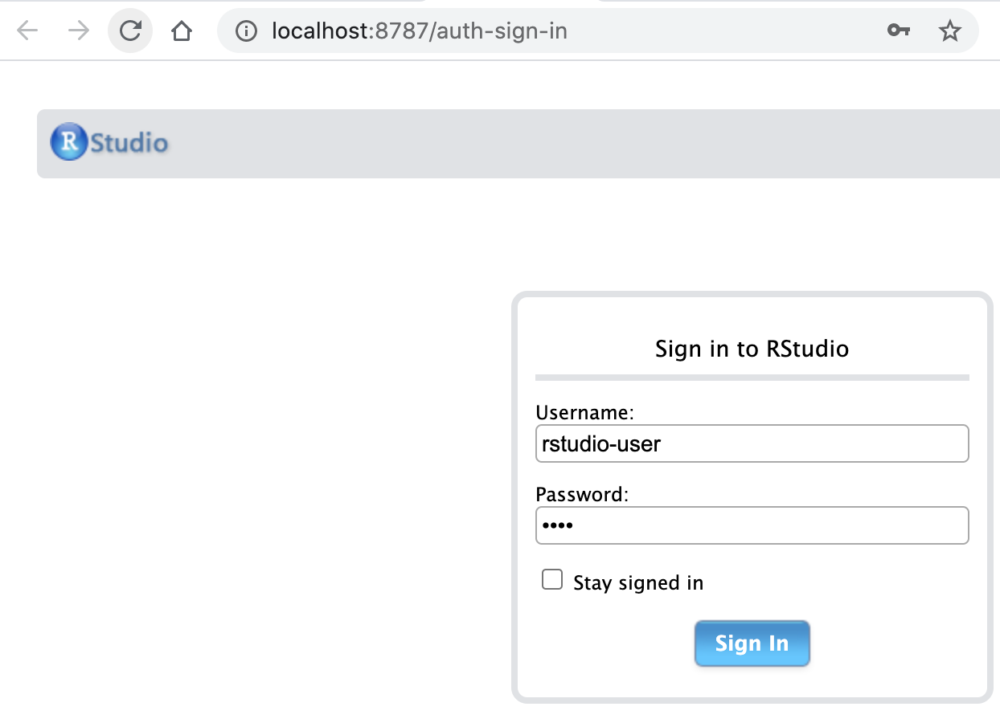
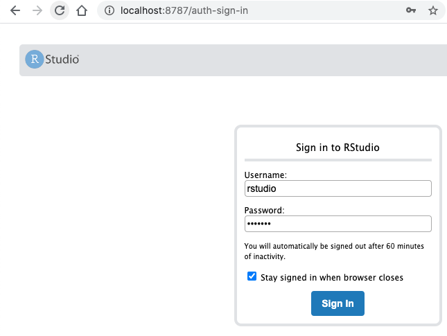
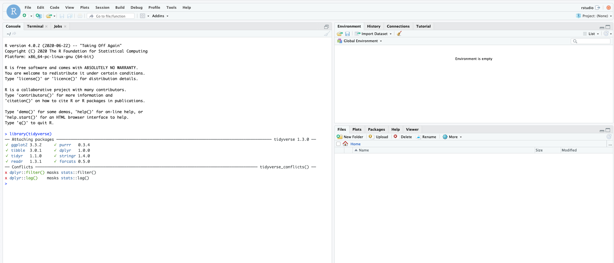
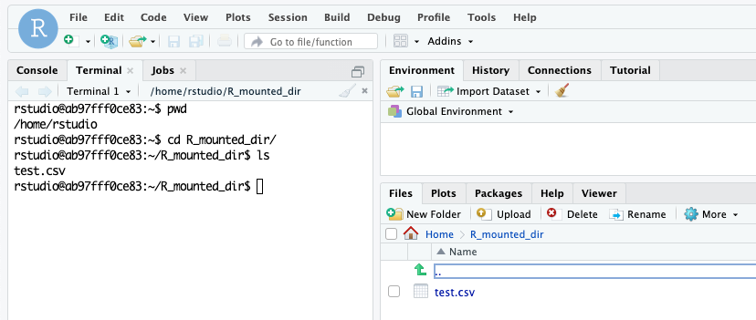

# Chapter05 Docker For R

### はじめに

ここでは、R言語をDockerファイルからイメージビルドし、コンテナで起動する方法をまとめておきます。また、実際はDockerファイル作らなくても、RockerプロジェクトというものがRのコミュニティには存在し、そこにあるイメージを使えば、Rstudio Serverの環境構築から必要なパッケージのインストールまで簡単に行うことができます。今回はその中でも`rocker/tidyverse`イメージを紹介します。

### CentOSでRstudio Serverを動かす

ここではCentOS6でRstudio Serverを動かす方法をまとめておきます。ちなみにCentOS7,8で試してみたものの、うまく環境構築できませんでした…なので、CentOS6でR version 3.5.2の環境構築を行います。[こちらの方の内容](https://rf00.hatenablog.com/entry/2018/12/31/200709)を参考にさせていただきました。

まずはディレクトリとDockerファイルを作成します。

```text
→ cd ~/Desktop
→ mkdir R
→ cd R
→ touch Dockerfile
```

それではDockerファイルを書いていきます。必要なコマンドをインストールし、Rをインストールしてから、Rstudio Serverをダウンロードしてからインストールします。そして、ユーザーを作成し、`8787`ポートを開放します。

```text
# Base OS
FROM centos:6

# Print standard error output
RUN set -x

# Install utility command
RUN yum -y install epel-release && \
    yum -y install wget && \
    yum -y install sudo

# Rpm file from here
# https://rstudio.com/products/rstudio/download-server/redhat-centos/
RUN sudo yum -y install R && \
    wget -q https://download2.rstudio.org/rstudio-server-rhel-1.1.463-x86_64.rpm && \
    sudo yum -y install rstudio-server-rhel-1.1.463-x86_64.rpm

# Install R Packages 
RUN sudo -i R -e 'install.packages("dplyr", repos = "https://cran.ism.ac.jp/")'

# Create user(rstudio-user) and Set password(pass)
RUN adduser rstudio-user && \
    echo "rstudio-user:pass" | chpasswd

# Publish port
EXPOSE 8787
```

それではイメージビルドしていきます。10分くらいかかりますが、完了すると、下記のようにイメージが作成されています。

```text
➜ docker build -t rstudio-server .
【略】
Successfully built 97f4bcb3990b
Successfully tagged rstudio-server:latest


➜ docker images
REPOSITORY          TAG                 IMAGE ID            CREATED             SIZE
rstudio-server      latest              97f4bcb3990b        43 seconds ago      1.86GB
centos              6                   d0957ffdf8a2        16 months ago       194MB
```

このイメージを使って、コンテナを起動して、`sudo rstudio-server verify-installation`コマンドでRstudio Serverを使えるようにします。

```text
➜ docker run -it --name rstudio-server -p 8787:8787 rstudio-server /bin/bash
[root@a984a979af02 /]# sudo rstudio-server verify-installation
Starting rstudio-server:                                   [  OK  ]
```

それでは`8787`ポートにローカルホストからアクセスします。さきほど設定したユーザーとパスワードを使ってログインします。



Dockerファイル内でインストールしたdplyrパッケージも、問題なくインストールされているのかを確認するために`library(dplyr)`を実行します。問題なく実行できています。

```text
> library("dplyr")

Attaching package: ‘dplyr’

The following objects are masked from ‘package:stats’:

    filter, lag

The following objects are masked from ‘package:base’:

    intersect, setdiff, setequal, union
```

次は、`rocker/tidyverse`イメージを使ってRstudio Serverの環境構築をおこないます。

### `rocker/tidyverse`イメージ

使い方はすごく簡単です。Dockerファイルも書く必要はありませんし、下記のコマンドを実行すればOKです。`--rm`はコンテナ終了時にコンテナを削除するオプションです。

```text
→ docker run --rm -p 8787:8787 rocker/verse
```

ローカルにインストールされていないコンテナなので、Docker Hubからイメージをを検索して、ローカルにインストールします。RStudio Serverのログイン情報については、ユーザー名とパスワードはいずれも`rstudio`です。コンソールにDoneと表示されれば、[http://localhost:8787/](http://localhost:8787/)にアクセスします。



ログインに成功したら、RStudio Serverが利用可能になります。`rocker/tidyverse`イメージなので、もちろん`tidyverse`も利用可能ですし、2020年7月現在ではR4.0が利用できます。



MySQLの環境構築でもやりましたが、こちらもコンテナの永続化がこの設定だとできません。volumeをコンテナにリンクして、データへのアクセスとファイルの保存を可能にします。ここではデスクトップの`R_mounted_dir`をマウント先に設定し、通信ができるかテストデータも作成しておます。

```text
➜ cd ~/Desktop/

➜ mkdir R_mounted_dir

➜ cd R_mounted_dir/

➜ touch test.csv
➜ cat test.csv 
col
"Data From Host"
```

こちらのマウント先を指定してコンテナを起動します。

```text
docker run --rm -p 8787:8787 -v ~/Desktop/R_mounted_dir:/home/rstudio/R_mounted_dir rocker/verse
```

RStudio Serverのターミナルからフォルダとサンプルのデータがあるのか確認します。



では、このサンプルデータを読み込んで、修正してマウント先のフォルダに保存します。

```text
df <- read_csv("~/R_mounted_dir/test.csv")
Parsed with column specification:
cols(
  col = col_character()
)

df
# A tibble: 1 x 1
  col           
  <chr>         
1 Data From Host

df2 <- df %>% bind_rows(tibble(col = "Data From Container"))
df2
# A tibble: 2 x 1
  col                
  <chr>              
1 Data From Host     
2 Data From Container

write_csv(df2, "~/R_mounted_dir/test2.csv")
```

ではホストからマウント先のディレクトリに`sample2.csv`があるか確認します。

```text
➜ ls
test2.csv	test.csv

➜ cat test2.csv 
col
Data From Host
Data From Container
```

問題なくホストとコンテンでデータのやり取りができています。

### パッケージをインストールする

ここまでは`rocker/tidyverse`イメージを使ってRStudio Serverの環境構築を行いました。しかし、これで分析ができるかというと難しいかもしれません。なぜなら、追加のパッケージをインストールする必要があるためです。もちろん、コンテナを起動した中でパッケージをインストールすれば利用できますが、コンテナを削除するとパッケージごと削除されます。

これらの問題は、`rocker/tidyverse`イメージをベースにDockerファイルを記述することで解決されます。パッケージのインストール方法はCentOSにRStudio Serverの環境構築を行った際にやっているので問題ないかと思います。

```text
FROM rocker/verse:latest


RUN R -e 'install.packages('glmnet', repos = "https://cran.ism.ac.jp/")'
```

 あとはこのイメージを使ってイメージビルドして、コンテナを起動すれば、追加のパッケージがインストールされた状態で、RStudio Serverを利用することが可能です。

