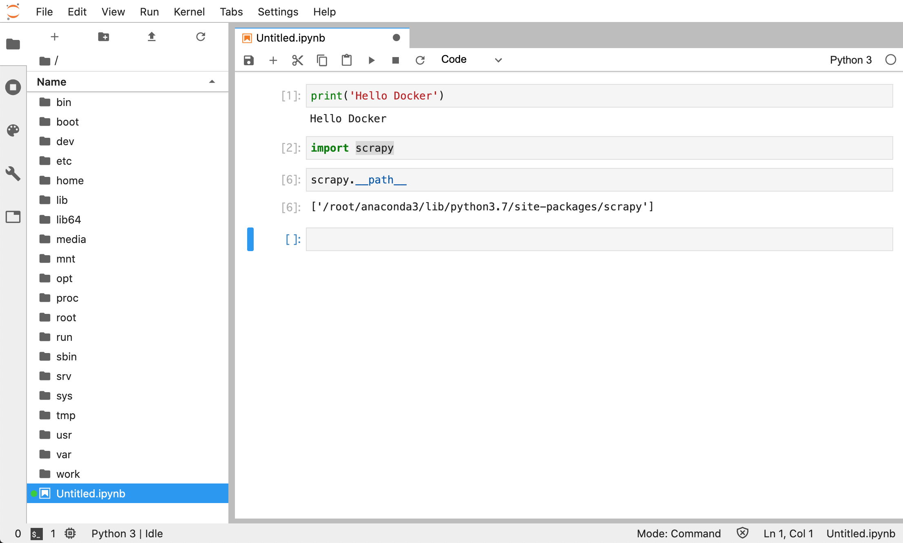

# Chapter06 Docker For Python

### はじめに

ここでは、Pythonの分析環境としてJupyter lab環境を構築するための方法をまとめておきます。Anacondaを利用する方法です。

### Dockerファイル

まずはDockerファイルを書いていきます。ビルドコンテキストとして、`python_docker`というディレクトリを用意します。あわせてマウントするようのディレクトリ`Python_mounted_dir`を作ります。

```text
➜ mkdir python_docker
➜ mkdir Python_mounted_dir

➜ cd python_docker
➜ touch Dockerfile
```

基本的な流れはubuntuのイメージを使って、Anacondaアーカイブからshファイルを取得して、それをバッチモードでインストールすることで環境を構築します。また、Pythonのライブラリもインストールしておきます。

```text
# Base image
FROM ubuntu:18.04

# Update
RUN set -x && \
    apt update && \
    apt upgrade -y

# Install util
RUN set -x && \
    apt install -y wget && \
    apt install -y sudo

# Install anaconda
# -b : batch mode
RUN set -x && \
    wget https://repo.anaconda.com/archive/Anaconda3-2020.02-Linux-x86_64.sh && \
    bash Anaconda3-2020.02-Linux-x86_64.sh -b && \
    rm Anaconda3-2020.02-Linux-x86_64.sh

# Path setting
ENV PATH $PATH:/root/anaconda3/bin

WORKDIR /root

# Install python library
ADD requirements.txt /root
RUN pip install -r requirements.txt

# Set root directory
WORKDIR ../
```

ではイメージビルドします。10分ほどかかってイメージが完成します。

```text
➜ docker build .
```

完成したイメージがこれです。このイメージでコンテナを起動します。

```text
➜ docker images
REPOSITORY          TAG                 IMAGE ID            CREATED             SIZE
<none>              <none>              ff9a890dd8d4        10 hours ago        3.48GB
ubuntu              18.04               d27b9ffc5667        4 days ago          64.2MB
```

まずは普通にコンテナを起動して、Python、Conda、追加でインストールしたScrapyがあるか確認します。

```text
➜ docker run -it --rm ff9a890dd8d4 sh
# python -V
Python 3.7.6

# conda -V
conda 4.8.2

# scrapy version
Scrapy 2.2.0
```

それではJupyter labにアクセスします。下記のコマンドでコンテナを起動し、ブラウザから[http://localhost:8888](http://localhost:8888/)にアクセスします。

```text
➜ docker run --rm --name jupyter -d -p 8888:8888 \
    -v ~/Desktop/Python_mounted_dir:/work \
    ff9a890dd8d4 \
    jupyter-lab --no-browser --port=8888 --ip=0.0.0.0 \
    --allow-root --NotebookApp.token=''
76fc63757065a97d392844d05d4e742f677721d454c22ac1793ada53ebe666e9

➜ docker ps 
CONTAINER ID        IMAGE               COMMAND                  CREATED             STATUS              PORTS                    NAMES
76fc63757065        ff9a890dd8d4        "jupyter-lab --no-br…"   5 seconds ago       Up 4 seconds        0.0.0.0:8888->8888/tcp   jupyter
```

このとおり環境が構築されています。



